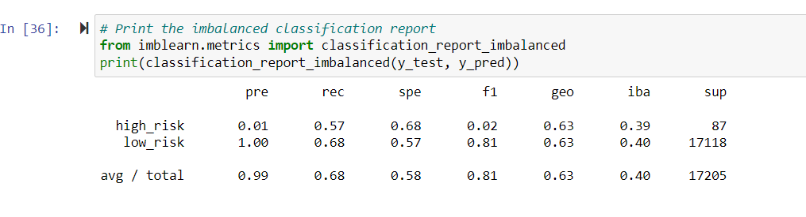
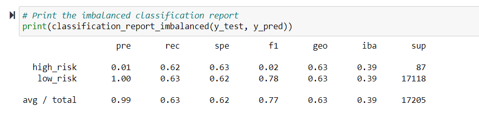
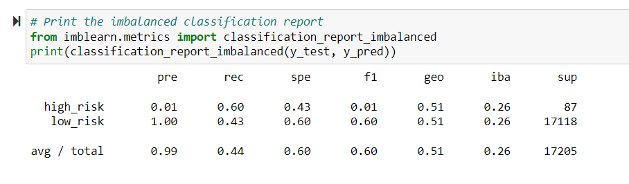
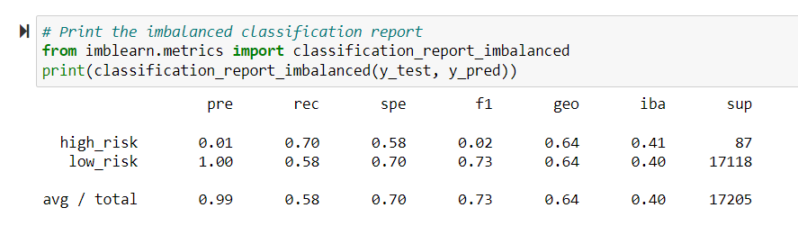
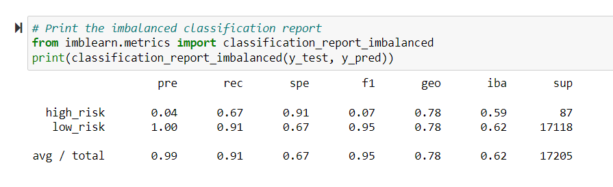
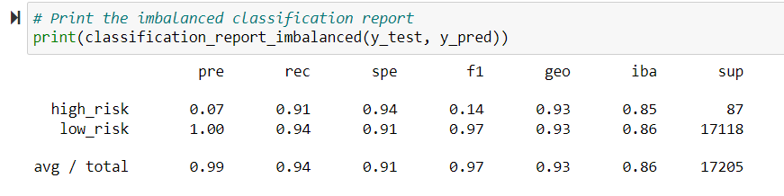

# Credit_Risk_Analysis
## Overview
#### In this project, we will be using Python to predict credit risks by creating and using different machine learning models. The algorithms and models used include:
* RandomOverSampler
* SMOTE
* ClusterCentroids Algorithm
* SMOTEENN Algorithm
* BalancedRandomForestClassifier
* EasyEnsembleClassifier
## Results
### Native Random Oversampling
#### Our Native Random Oversampling gave us an accuracy score of 0.629. Our precision score was low for high risk loans and high for low risk loans. Our precision is almost 100% with a 68% sensitivity.

### SMOTE Oversampling 
#### Our SMOTE Oversampling gave us an accuracy score of 0.627. Our precision score was low for high risk loans and high for low risk loans. Our precision is almost 100% with a 63% sensitivity.

### Cluster Centroids Undersampling
#### Our Cluster Centroids Undersampling gave us an accuracy score of 0.627. Our precision score was low for high risk loans and high for low risk loans. Our precision is almost 100% with a 44% sensitivity.

### Combination Sampling
#### Our Combination Sampling gave us an accuracy score of 0.516. Our precision score was low for high risk loans and high for low risk loans. Our precision is almost 100% with a 58% sensitivity.

### Balanced Random Forest Classifier
#### Our Balanced Random Forest Classifier gave us an accuracy score of 0.787. Our precision score was low for high risk loans and high for low risk loans. However, at 0.04, it is higher than results from Native Random Oversampling, SMOTE Oversampling, Cluster Centroids Undersampling, and Combination Sampling. Our precision is almost 100% with a 91% sensitivity.

### Easy Ensemble AdaBoost Classifier
#### Our Easy Ensemble AdaBoost Classifier gave us an accuracy score of 0.925, our highest score yet. Our precision score was low for high risk loans and high for low risk loans. However, at 0.07, it is higher than results from Native Random Oversampling, SMOTE Oversampling, Cluster Centroids Undersampling, Combination Sampling, and Balanced Random Forest Classifier. Our precision is almost 100% with a 94% sensitivity.

## Summary
#### All of the models with the exception of Easy Ensemble depict a low precision rate. For risk assessment, the best model to use would be Easy Ensemble due to its 92.5% accuracy rate and highest score for all risk loans. In my personal opinion, I would not use any of these machine learning models for proper assessment since the F-score for our best model was a low score of 0.14. Using these algorithms would be too risky for creditors and it will not give you the highest accuracy in its predictions. 
